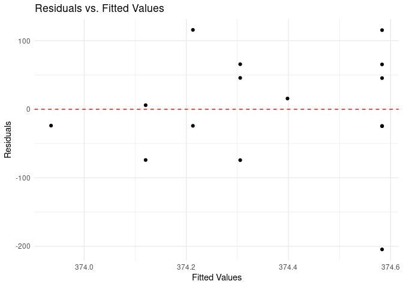

Activity 2
================

## Task 1: Obtaining the dataset

**1.Explain why you chose that - why is it interesting to you?**

-   I have taken the dataset of Starbucks Nutrition Facts.I felt knowing
    the nutrition facts for several Starbucks food items is interesting.

**2.Explain where you obtained your data from.**

-   I have obtained the dataset from Kaggle public domain datasets.

**3.Who created this dataset?**

-   The dataset was created by Utkarsh Singh.

## Task 2: Load the necessary packages

``` r
library(tidyverse)
```

    ## ── Attaching packages ─────────────────────────────────────── tidyverse 1.3.2 ──
    ## ✔ ggplot2 3.4.2     ✔ purrr   0.3.4
    ## ✔ tibble  3.1.8     ✔ dplyr   1.0.9
    ## ✔ tidyr   1.2.0     ✔ stringr 1.4.1
    ## ✔ readr   2.1.2     ✔ forcats 0.5.2
    ## ── Conflicts ────────────────────────────────────────── tidyverse_conflicts() ──
    ## ✖ dplyr::filter() masks stats::filter()
    ## ✖ dplyr::lag()    masks stats::lag()

``` r
library(tidymodels)
```

    ## ── Attaching packages ────────────────────────────────────── tidymodels 1.0.0 ──
    ## ✔ broom        1.0.4     ✔ rsample      1.1.0
    ## ✔ dials        1.0.0     ✔ tune         1.0.0
    ## ✔ infer        1.0.3     ✔ workflows    1.0.0
    ## ✔ modeldata    1.0.0     ✔ workflowsets 1.0.0
    ## ✔ parsnip      1.0.1     ✔ yardstick    1.0.0
    ## ✔ recipes      1.0.1     
    ## ── Conflicts ───────────────────────────────────────── tidymodels_conflicts() ──
    ## ✖ scales::discard() masks purrr::discard()
    ## ✖ dplyr::filter()   masks stats::filter()
    ## ✖ recipes::fixed()  masks stringr::fixed()
    ## ✖ dplyr::lag()      masks stats::lag()
    ## ✖ yardstick::spec() masks readr::spec()
    ## ✖ recipes::step()   masks stats::step()
    ## • Use suppressPackageStartupMessages() to eliminate package startup messages

``` r
library(ggplot2)
library(dplyr)
library(broom)
```

## Task 3: Load your data

``` r
starbucks<- read_csv("starbucks.csv")
```

    ## New names:
    ## Rows: 77 Columns: 8
    ## ── Column specification
    ## ──────────────────────────────────────────────────────── Delimiter: "," chr
    ## (2): item, type dbl (6): ...1, calories, fat, carb, fiber, protein
    ## ℹ Use `spec()` to retrieve the full column specification for this data. ℹ
    ## Specify the column types or set `show_col_types = FALSE` to quiet this message.
    ## • `` -> `...1`

``` r
head(starbucks)
```

    ## # A tibble: 6 × 8
    ##    ...1 item                        calories   fat  carb fiber protein type  
    ##   <dbl> <chr>                          <dbl> <dbl> <dbl> <dbl>   <dbl> <chr> 
    ## 1     1 8-Grain Roll                     350     8    67     5      10 bakery
    ## 2     2 Apple Bran Muffin                350     9    64     7       6 bakery
    ## 3     3 Apple Fritter                    420    20    59     0       5 bakery
    ## 4     4 Banana Nut Loaf                  490    19    75     4       7 bakery
    ## 5     5 Birthday Cake Mini Doughnut      130     6    17     0       0 bakery
    ## 6     6 Blueberry Oat Bar                370    14    47     5       6 bakery

``` r
glimpse(starbucks)
```

    ## Rows: 77
    ## Columns: 8
    ## $ ...1     <dbl> 1, 2, 3, 4, 5, 6, 7, 8, 9, 10, 11, 12, 13, 14, 15, 16, 17, 18…
    ## $ item     <chr> "8-Grain Roll", "Apple Bran Muffin", "Apple Fritter", "Banana…
    ## $ calories <dbl> 350, 350, 420, 490, 130, 370, 460, 370, 310, 420, 380, 320, 3…
    ## $ fat      <dbl> 8, 9, 20, 19, 6, 14, 22, 14, 18, 25, 17, 12, 17, 21, 5, 18, 1…
    ## $ carb     <dbl> 67, 64, 59, 75, 17, 47, 61, 55, 32, 39, 51, 53, 34, 57, 52, 7…
    ## $ fiber    <dbl> 5, 7, 0, 4, 0, 5, 2, 0, 0, 0, 2, 3, 2, 2, 3, 3, 2, 3, 0, 2, 0…
    ## $ protein  <dbl> 10, 6, 5, 7, 0, 6, 7, 6, 5, 7, 4, 6, 5, 5, 12, 7, 8, 6, 0, 10…
    ## $ type     <chr> "bakery", "bakery", "bakery", "bakery", "bakery", "bakery", "…

``` r
dimensions <- dim(starbucks)
num_rows <- dimensions[1]  # Number of rows
num_cols <- dimensions[2]  # Number of columns

# Printing the dimensions
print(paste("Number of rows:", num_rows))
```

    ## [1] "Number of rows: 77"

``` r
print(paste("Number of columns:", num_cols))
```

    ## [1] "Number of columns: 8"

**1.What are the dimensions of the dataset? What does each row
represent?**

-   The dimensions of the dataset are 77(rows/observations) x
    8(columns/variables) Each row corresponds to a specific food item.

-   It contains 7 variables/columns: item, calories, fat, carb, fiber,
    protein, and type.

-   Each row represents a specific food item.

**2.Do you have multiple measurements over time? Across different
locations? Do you plan on focusing on all of these values? Do you need
to subset your dataset to be more focused?**

-   There is no explicit information about multiple measurements over
    time or across different locations in the Starbucks dataset. The
    dataset primarily consists of food items and their corresponding
    nutritional information.

-   I am interested in analyzing the entire dataset and explore
    relationships between the variables.But for Simple Linera Regression
    I would like to subset the data to include only the “calories” and
    “fiber” variables.

**3.What two variables are you focusing on? That is, what is your
research question and what information do you have to explore this
question?**

-   The two variable that I am focusing is “calories” as the dependent
    variable and “fiber” as the independent variable.

-   My research question is to explore how the fiber content
    (independent variable) relates to the number of calories (dependent
    variable) in the food items which is provided in the starbucks
    dataset.

# Task 4: Explore your data

**4.Create a new R code chunk (or multiple R code chunks) and plot each
of your variables - separately and together. Be sure to describe what
you notice/wonder. Does the relationship look linear?**

``` r
colnames(starbucks)
```

    ## [1] "...1"     "item"     "calories" "fat"      "carb"     "fiber"    "protein" 
    ## [8] "type"

``` r
# Plotting variables separately
# 1. Fat
ggplot(starbucks, aes(x = factor(1), y = fat)) +
  geom_boxplot() +
  labs(title = "Box Plot of Fat",
       x = "", y = "Fat")
```

<!-- -->

``` r
# 2. Type
ggplot(starbucks, aes(x = type)) +
  geom_bar() +
  labs(title = "Bar Plot of Type",
       x = "Type", y = "Count")
```

<!-- -->

``` r
# Plotting variables together
ggplot(starbucks, aes(x = fat, y = calories)) +
  geom_point() +
  labs(title = "Scatter Plot of Fat vs Calories",
       x = "Fat", y = "Calories")
```

<!-- -->

-   The box plot shows the distribution of the ‘fat’ variable and the
    distribution of fat appears to be positively skewed, with a few high
    values as outliers.

-   The bar plot represents the frequency/count of each ‘type’ category.
    The ‘bakery’ type appears to be the most common, followed by
    ‘petite’, ‘sandwich’, ‘bistro box’, ‘hot breakfast’, and ‘salad’.

-   The scatter plot shows the relationship between ‘fat’ and ’calories.

-   The plot does not show a clear linear relationship between ‘fat’ and
    ‘calories’.There seems to be a general positive trend where higher
    values of ‘fat’ tend to correspond to higher values of ‘calories’.

``` r
# Scatter plot for calories
plot_calories <- ggplot(starbucks, aes(x = calories, y = "")) +
  geom_point(color = "blue") +
  labs(x = "Calories") +
  theme_minimal()

# Scatter plot for fat
plot_fat <- ggplot(starbucks, aes(x = fat, y = "")) +
  geom_point(color = "red") +
  labs(x = "Fat") +
  theme_minimal()

# Scatter plot for carb
plot_carb <- ggplot(starbucks, aes(x = carb, y = "")) +
  geom_point(color = "green") +
  labs(x = "Carb") +
  theme_minimal()

# Scatter plot for fiber
plot_fiber <- ggplot(starbucks, aes(x = fiber, y = "")) +
  geom_point(color = "purple") +
  labs(x = "Fiber") +
  theme_minimal()

# Scatter plot for protein
plot_protein <- ggplot(starbucks, aes(x = protein, y = "")) +
  geom_point(color = "orange") +
  labs(x = "Protein") +
  theme_minimal()

# Scatter plot for the relationship between fiber and calories
plot_fiber_calories <- ggplot(starbucks, aes(x = fiber, y = calories)) +
  geom_point(color = "blue") +
  labs(x = "Fiber", y = "Calories") +
  theme_minimal()

# Display the scatter plots
plot_calories
```

<!-- -->

``` r
plot_fat
```

<!-- -->

``` r
plot_carb
```

<!-- -->

``` r
plot_fiber
```

<!-- -->

``` r
plot_protein
```

<!-- -->

``` r
plot_fiber_calories
```

<!-- -->

-   The scatter plot for fiber and calories reveals a somewhat positive
    linear trend. As the fiber content increases, there is a tendency
    for the calorie count to rise. However, there is still considerable
    variation in calorie levels for different fiber values.

## Task 5: Sum of squared residuals

**5.What was the smallest sum of squares that you got? What was the
relationship between your line and the data points?**

-   Sum of Squares: 918042
-   Coefficients: (Intercept) x  
    306.8311 0.2348  
-   The relationship is linear.

**6.What was the largest sum of squares you got? What was the
relationship between your line and the data points?**

-   Sum of Squares: 8869465
-   Coefficients: (Intercept) x  
    -86.76 50.00
-   The relationship is linear.

## Task 6: The linear model

``` r
# Create a subset of the data with the variables of interest
subset_data1 <- starbucks %>%
  select(calories, fiber)

# Fit the linear regression model
lm_model <- lm(calories ~ fiber, data = subset_data1)

# Summarize the model
summary(lm_model)
```

    ## 
    ## Call:
    ## lm(formula = calories ~ fiber, data = subset_data1)
    ## 
    ## Residuals:
    ##      Min       1Q   Median       3Q      Max 
    ## -255.961  -55.961    5.042   71.040  190.037 
    ## 
    ## Coefficients:
    ##             Estimate Std. Error t value Pr(>|t|)    
    ## (Intercept)   309.96      16.99  18.245   <2e-16 ***
    ## fiber          13.00       5.56   2.338   0.0221 *  
    ## ---
    ## Signif. codes:  0 '***' 0.001 '**' 0.01 '*' 0.05 '.' 0.1 ' ' 1
    ## 
    ## Residual standard error: 102.4 on 75 degrees of freedom
    ## Multiple R-squared:  0.06794,    Adjusted R-squared:  0.05551 
    ## F-statistic: 5.467 on 1 and 75 DF,  p-value: 0.02205

``` r
# Plot the regression line
ggplot(subset_data1, aes(x = fiber, y = calories)) +
  geom_point() +
  geom_smooth(method = "lm", se = FALSE) +
  labs(x = "Fiber", y = "Calories") +
  theme_minimal()
```

    ## `geom_smooth()` using formula = 'y ~ x'

<!-- -->

``` r
# Created a parsnip specification for a linear model

lm_spec <- linear_reg() %>%
  set_mode("regression") %>%
  set_engine("lm")

# Fit our specification to our data

slr_mod <- lm_spec %>% 
fit(calories ~ fiber, data = subset_data1)

# View our model output
tidy(slr_mod)
```

    ## # A tibble: 2 × 5
    ##   term        estimate std.error statistic  p.value
    ##   <chr>          <dbl>     <dbl>     <dbl>    <dbl>
    ## 1 (Intercept)    310.      17.0      18.2  2.67e-29
    ## 2 fiber           13.0      5.56      2.34 2.21e- 2

**1.Interpret the y-intercept.**

-   The least squares regression line for the linear model is:

         calories = 310 + 13.0 * fiber

-   Interpretations:The y-intercept (310) represents the estimated
    average number of calories when the fiber content is zero. In other
    words, when there is no fiber in the food item, the model estimates
    that the average number of calories is 310.

**2.Interpret the slope**

-   The slope (13.0) represents the estimated change in the number of
    calories for a one-unit increase in fiber content, holding other
    variables constant. So, for each additional unit of fiber in the
    food item, the model estimates that the number of calories increases
    by 13.0 units on average.

# Day-2 Activity \[Using the training data\]

## Splitting the dataset

``` r
# set seed before random split
set.seed(123)

# put 80% of the data into the training set
starbucks_split <- initial_split(starbucks, prop = 0.80)


# assign the two splits to data frames - with descriptive names
starbucks_train <- training(starbucks_split)
starbucks_test <- testing(starbucks_split)

# splits

starbucks_train
```

    ## # A tibble: 61 × 8
    ##     ...1 item                            calor…¹   fat  carb fiber protein type 
    ##    <dbl> <chr>                             <dbl> <dbl> <dbl> <dbl>   <dbl> <chr>
    ##  1    31 Petite Vanilla Bean Scone           140     5    21     0       0 bake…
    ##  2    51 Birthday Cake Pop                   170     9    22     0       0 peti…
    ##  3    14 Chocolate Old-Fashioned Doughn…     420    21    57     2       5 bake…
    ##  4    67 Deluxe Fruit Blend                   80     0    20     2       0 salad
    ##  5    42 Cheese & Fruit                      480    28    39     6      18 bist…
    ##  6    50 Apple Pie                           180     7    27     0       2 peti…
    ##  7    43 Chicken & Hummus                    270     8    29     6      16 bist…
    ##  8    75 Greek Yogurt Honey Parfait          300    12    44     0       8 parf…
    ##  9    25 Marble Pound Cake                   350    13    54     0       6 bake…
    ## 10    57 Red Velvet Whoopie Pie              190    11    21     0       0 peti…
    ## # … with 51 more rows, and abbreviated variable name ¹​calories

``` r
starbucks_test
```

    ## # A tibble: 16 × 8
    ##     ...1 item                            calor…¹   fat  carb fiber protein type 
    ##    <dbl> <chr>                             <dbl> <dbl> <dbl> <dbl>   <dbl> <chr>
    ##  1     2 Apple Bran Muffin                   350   9      64     7       6 bake…
    ##  2     3 Apple Fritter                       420  20      59     0       5 bake…
    ##  3     4 Banana Nut Loaf                     490  19      75     4       7 bake…
    ##  4    22 Iced Lemon Pound Cake               490  23      67     0       5 bake…
    ##  5    24 Maple Oat Pecan Scone               440  18      59     3       8 bake…
    ##  6    33 Pumpkin Bread                       390  14      61     2       6 bake…
    ##  7    40 Starbucks Classic Coffee Cake       440  19      63     0       6 bake…
    ##  8    46 Protein                             380  19      37     5      13 bist…
    ##  9    47 Salumi & Cheese                     420  26      22     3      25 bist…
    ## 10    58 Tiramisu Cake Pop                   170   9      22     0       0 peti…
    ## 11    59 Bacon & Gouda Artisan Breakfas…     350  18      30     0      17 hot …
    ## 12    60 Chicken Sausage Breakfast Wrap      300  10      33     5      14 hot …
    ## 13    61 Ham & Cheddar Artisan Breakfas…     350  16      31     0      20 hot …
    ## 14    66 Veggie & Monterey Jack Artisan…     350  18      30     0      17 hot …
    ## 15    72 Roasted Vegetable Panini            350  12      48     4      13 sand…
    ## 16    77 Strawberry & Blueberry Yogurt …     300   3.5    60     3       7 parf…
    ## # … with abbreviated variable name ¹​calories

``` r
dimensions <- dim(starbucks_train)
num_rows <- dimensions[1]  # Number of rows
num_cols <- dimensions[2]  # Number of columns

# Printing the dimensions
print(paste("Number of rows:", num_rows))
```

    ## [1] "Number of rows: 61"

``` r
print(paste("Number of columns:", num_cols))
```

    ## [1] "Number of columns: 8"

``` r
# Create a subset of the training data with the variables of interest
subset_data2 <- starbucks_train %>%
  select(calories, fiber)

# Fit the linear regression model
lm_model <- lm(calories ~ fiber, data = subset_data2)

# Summarize the model
summary(lm_model)
```

    ## 
    ## Call:
    ## lm(formula = calories ~ fiber, data = subset_data2)
    ## 
    ## Residuals:
    ##      Min       1Q   Median       3Q      Max 
    ## -245.880  -93.980    3.045   74.120  208.170 
    ## 
    ## Coefficients:
    ##             Estimate Std. Error t value Pr(>|t|)    
    ## (Intercept)  291.830     19.705  14.810   <2e-16 ***
    ## fiber         17.025      6.521   2.611   0.0114 *  
    ## ---
    ## Signif. codes:  0 '***' 0.001 '**' 0.01 '*' 0.05 '.' 0.1 ' ' 1
    ## 
    ## Residual standard error: 104.8 on 59 degrees of freedom
    ## Multiple R-squared:  0.1036, Adjusted R-squared:  0.08838 
    ## F-statistic: 6.817 on 1 and 59 DF,  p-value: 0.01143

``` r
# Plot the regression line
ggplot(subset_data2, aes(x = fiber, y = calories)) +
  geom_point() +
  geom_smooth(method = "lm", se = FALSE) +
  labs(x = "Fiber", y = "Calories") +
  theme_minimal()
```

    ## `geom_smooth()` using formula = 'y ~ x'

<!-- -->

``` r
# Created a parsnip specification for a linear model for training dataset

lm_spec <- linear_reg() %>%
  set_mode("regression") %>%
  set_engine("lm")

# Fit our specification to our training data

slr_mod <- lm_spec %>% 
fit(calories ~ fiber, data = subset_data2)

# View our model output
tidy(slr_mod)
```

    ## # A tibble: 2 × 5
    ##   term        estimate std.error statistic  p.value
    ##   <chr>          <dbl>     <dbl>     <dbl>    <dbl>
    ## 1 (Intercept)    292.      19.7      14.8  1.55e-21
    ## 2 fiber           17.0      6.52      2.61 1.14e- 2

**1.Interpret the y-intercept.**

-   The least squares regression line for the linear model is:

         calories = 292 + 17 * fiber

-   Interpretations:The y-intercept (intercept term) is 292. This
    represents the predicted number of calories when the fiber content
    is zero. In this case, it suggests that food items with zero fiber
    would have an estimated calorie count of 292.

**2.Interpret the slope**

-   The slope of the fiber variable is 17. It indicates that for each
    unit increase in fiber, the predicted number of calories increases
    by 17. This implies that there is a positive relationship between
    fiber content and calorie count. As the fiber content of a food item
    increases, its calorie count tends to increase as well.

<!-- -->

    # Generate augmented data for testing using the model and testing data
    slr_aug <- augment(slr_fit, new_data = starbucks_test)

    # View the augmented data
    slr_aug

``` r
# Load the required libraries
library(broom)

# Create a parsnip specification for a linear model for the training dataset
lm_spec <- linear_reg() %>%
  set_mode("regression") %>%
  set_engine("lm")

# Fit the specification to the training data
slr_mod <- lm_spec %>%
  fit(calories ~ fiber, data = subset_data2)

# Use augment to calculate the fitted values and residuals
slr_aug <- augment(slr_mod, new_data = starbucks_test)

# View the augmented data with fitted values and residuals
slr_aug
```

    ## # A tibble: 16 × 10
    ##     ...1 item              calor…¹   fat  carb fiber protein type  .pred  .resid
    ##    <dbl> <chr>               <dbl> <dbl> <dbl> <dbl>   <dbl> <chr> <dbl>   <dbl>
    ##  1     2 Apple Bran Muffin     350   9      64     7       6 bake…  411.  -61.0 
    ##  2     3 Apple Fritter         420  20      59     0       5 bake…  292.  128.  
    ##  3     4 Banana Nut Loaf       490  19      75     4       7 bake…  360.  130.  
    ##  4    22 Iced Lemon Pound…     490  23      67     0       5 bake…  292.  198.  
    ##  5    24 Maple Oat Pecan …     440  18      59     3       8 bake…  343.   97.1 
    ##  6    33 Pumpkin Bread         390  14      61     2       6 bake…  326.   64.1 
    ##  7    40 Starbucks Classi…     440  19      63     0       6 bake…  292.  148.  
    ##  8    46 Protein               380  19      37     5      13 bist…  377.    3.04
    ##  9    47 Salumi & Cheese       420  26      22     3      25 bist…  343.   77.1 
    ## 10    58 Tiramisu Cake Pop     170   9      22     0       0 peti…  292. -122.  
    ## 11    59 Bacon & Gouda Ar…     350  18      30     0      17 hot …  292.   58.2 
    ## 12    60 Chicken Sausage …     300  10      33     5      14 hot …  377.  -77.0 
    ## 13    61 Ham & Cheddar Ar…     350  16      31     0      20 hot …  292.   58.2 
    ## 14    66 Veggie & Montere…     350  18      30     0      17 hot …  292.   58.2 
    ## 15    72 Roasted Vegetabl…     350  12      48     4      13 sand…  360.   -9.93
    ## 16    77 Strawberry & Blu…     300   3.5    60     3       7 parf…  343.  -42.9 
    ## # … with abbreviated variable name ¹​calories

``` r
# Re-run the linear regression model
slr_mod <- lm(calories ~ fiber, data = starbucks_test)

# Calculate fitted values
fitted_values <- predict(slr_mod)

# Calculate residuals
residuals <- resid(slr_mod)

# Create a data frame to store the fitted values and residuals
slr_aug <- data.frame(fitted_values = fitted_values, residuals = residuals)

slr_aug
```

    ##    fitted_values  residuals
    ## 1       373.9352  -23.93519
    ## 2       374.5833   45.41667
    ## 3       374.2130  115.78704
    ## 4       374.5833  115.41667
    ## 5       374.3056   65.69444
    ## 6       374.3981   15.60185
    ## 7       374.5833   65.41667
    ## 8       374.1204    5.87963
    ## 9       374.3056   45.69444
    ## 10      374.5833 -204.58333
    ## 11      374.5833  -24.58333
    ## 12      374.1204  -74.12037
    ## 13      374.5833  -24.58333
    ## 14      374.5833  -24.58333
    ## 15      374.2130  -24.21296
    ## 16      374.3056  -74.30556

``` r
# Generate predictions on the testing data using augmented data
predictions <- slr_aug$.fitted

# Create a data frame with the actual values and predicted values
prediction_results <- data.frame(
  Actual = slr_aug$calories,
  Predicted = predictions
)

# View the prediction results
prediction_results
```

    ## data frame with 0 columns and 0 rows

``` r
# Generate augmented data for testing using the model and testing data
slr_aug <- augment(slr_mod, newdata = starbucks_test)

# Compute residuals manually
slr_aug$residuals <- slr_aug$.resid

# Create a plot of residuals vs. fitted values
ggplot(slr_aug, aes(x = .fitted, y = residuals)) +
  geom_point() +
  geom_hline(yintercept = 0, linetype = "dashed", color = "red") +
  labs(x = "Fitted Values", y = "Residuals") +
  ggtitle("Residuals vs. Fitted Values") +
  theme_minimal()
```

<!-- -->

-   Here the plots are randomly scattered throughout the plane
    indicating that there isn’t any linear relation between the
    variables.
